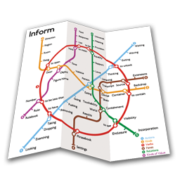

## Hi there 👋

I’m currently busy with college, but in my spare time I still work on various projects, such as [The Septenary Forest](https://github.com/Yrahcaz7/The-Septenary-Forest).

### 🛠 Used Languages and Libraries:

&nbsp;
&nbsp;
&nbsp;
&nbsp;
&nbsp;
&nbsp;
&nbsp;
&nbsp;
&nbsp;

### 🔥 My Stats:

&nbsp;

